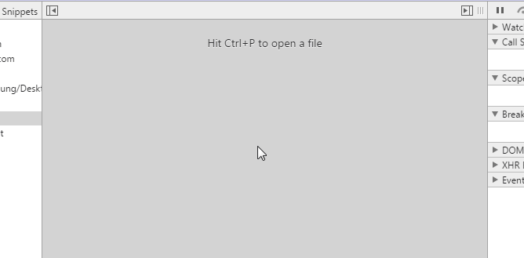
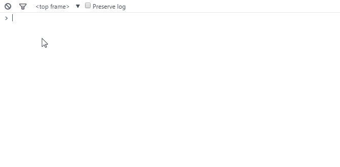
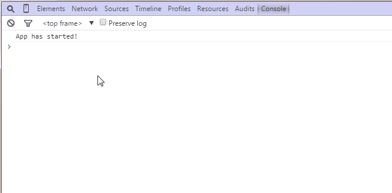
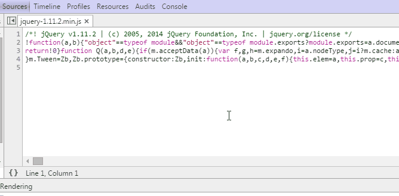
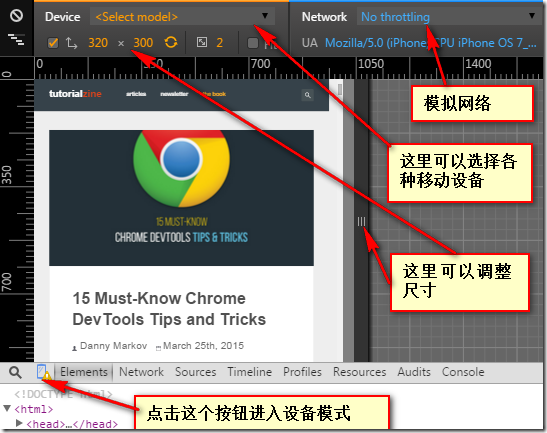
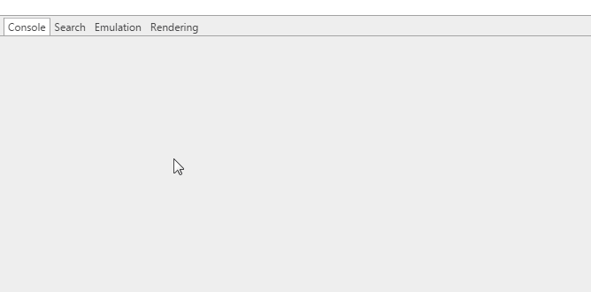
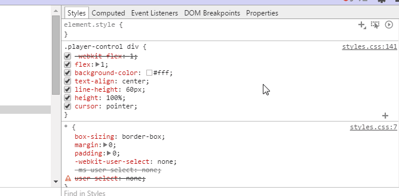
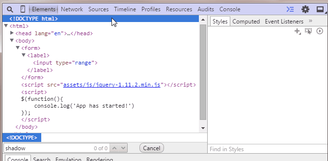

# 15个必须知道的chrome开发者技巧

### 1. 快速切换文件

`Ctrl + P` (`Cmd + P` on Mac)

### 2. 在源代码中搜索

`Ctrl + Shift + F` (`Cmd + Opt + F`)

### 3. 快速跳转到指定行

`Ctrl + G` (`Cmd + L` for Mac)

另外一种方式：`Ctrl + O` 输入`:`和*行数*

### 4. 在控制台选择元素

- `$()`–`document.querySelector()`的简写，返回第一个和css选择器匹配的元素。例如$(‘div’)返回这个页面中第一个div元素
- `$$()`–`document.querySelectorAll()`的简写，返回一个和css选择器匹配的元素数组。
- `$0-$4`–依次返回五个最近你在元素面板选择过的DOM元素的历史记录，`$0`是最新的记录，以此类推。

想要了解更多控制台命令，戳这里：[Command Line API](https://developer.chrome.com/devtools/docs/commandline-api)

### 5. 使用多个插入符进行选择

按住`Ctrl` (`Cmd` for Mac)

### 6. 保存记录

`Console` 标签下勾选 `Preserve Log`

### 7. 优质打印

`Sources` 标签左下角 `{}` 按钮

### 8. 设备模式

### 9. 设备传感仿真

`Show drawer.` -> `Emulation` -> `Sensors`

### 10. 颜色选择器

### 11. 强制改变元素状态

### 12. 可视化的DOM阴影

`Settings` -> `General` 中切换成 `Show user agent shadow DOM`

### 13. 选择下一个匹配项

`Sources` 标签下编辑文件时，按下 `Ctrl + D` (`Cmd + D`) 

### 14. 改变颜色格式

`Shift + Click`

### 15. 通过workspaces来编辑本地 文件

Workspaces是Chrome DevTools的一个强大功能，这使DevTools变成了一个真正的IDE。Workspaces会将Sources选项卡中的文件和本地项目中的文件进行匹配，所以你可以直接编辑和保存，而不必复制/粘贴外部改变的文件到编辑器。

为了配置Workspaces，只需打开Sources选项，然后右击左边面板的任何一个地方，选择**Add Folder To Worskpace**，或者只是把你的整个工程文件夹拖放入Developer Tool。现在，无论在哪一个文件夹，被选中的文件夹，包括其子目录和所有文件都可以被编辑。为了让Workspaces更高效，你可以将页面中用到的文件映射到相应的文件夹，允许在线编辑和简单的保存。

了解更多关于Workspaces的使用，戳这里：[Workspaces](https://developer.chrome.com/devtools/docs/workspaces)
